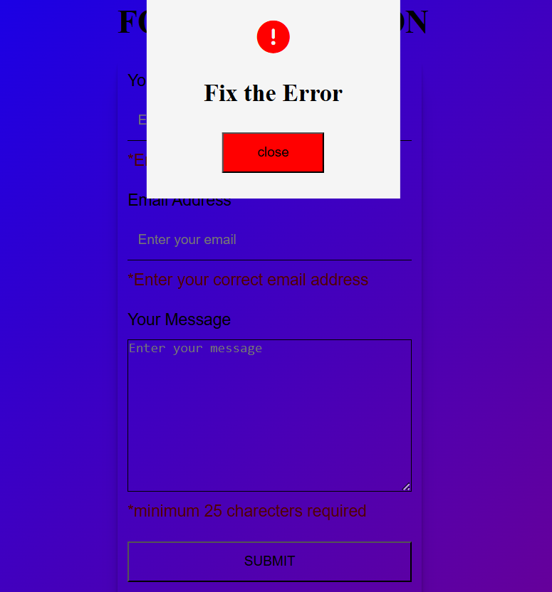

# Form Validation Website 

This is a Form Validation Website built using HTML, CSS, and JavaScript. It validates user input for name, email, and message fields with client-side validation before submission. Users are alerted with errors if the input does not meet the required criteria, ensuring only valid data is submitted.

---

## Features 🚀

- Real-time form validation for:
   - Name: Cannot be empty.
   - Email: Must match a valid email pattern.
   - Message: Must contain at least 25 characters.

- Custom error alerts displayed below each field for invalid input.

- Pop-up success message on form submission.

- Reset alerts using close buttons to hide error/success messages.

## Demo 📸
Open the project click [here](https://naveenkumar-developer.github.io/formValidation/)

---

## Technologies Used 📝

- HTML 5

- CSS3

- Javascript(DOM manipulation, Events)

---

## How It Works 🧪

1.When the user clicks the Submit button:

   - The name field is checked to ensure it is not empty.
   -  The email field is validated against a regular expression for correct email format.
   -  The message field must contain at least 25 characters.
  
2.If all fields are valid:

  - The form displays a success pop-up.
  - The input fields are reset.

3.If validation fails:

 - Error messages appear under the corresponding fields.
 - An alert pop-up is shown.

4.Close buttons allow users to hide the pop-ups after reading them.

---

